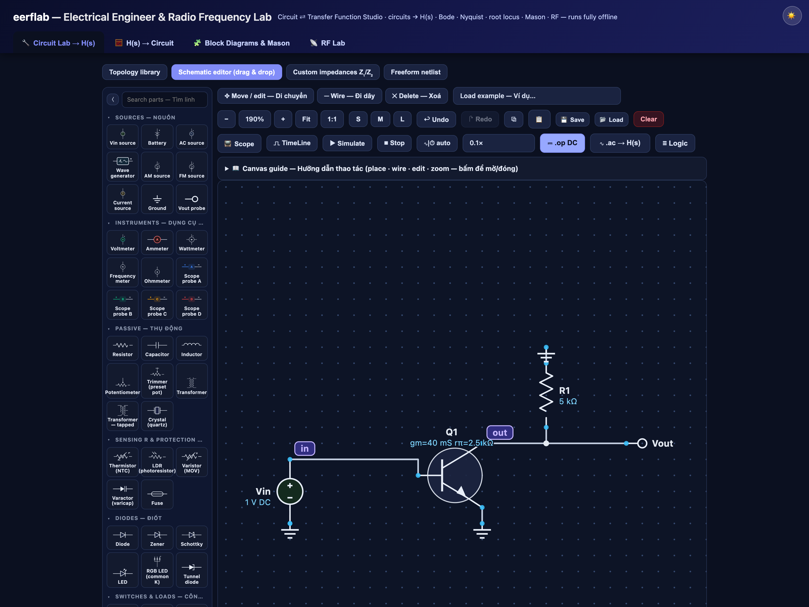
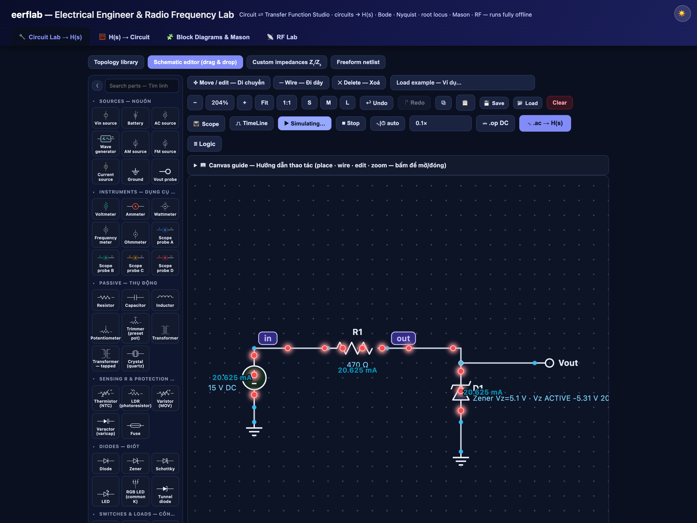
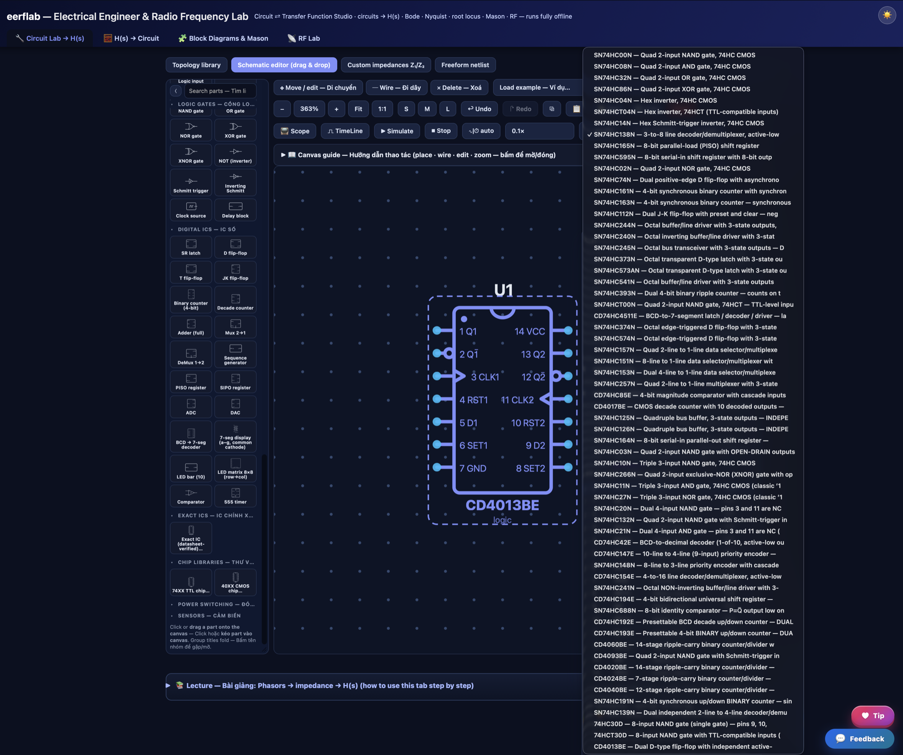
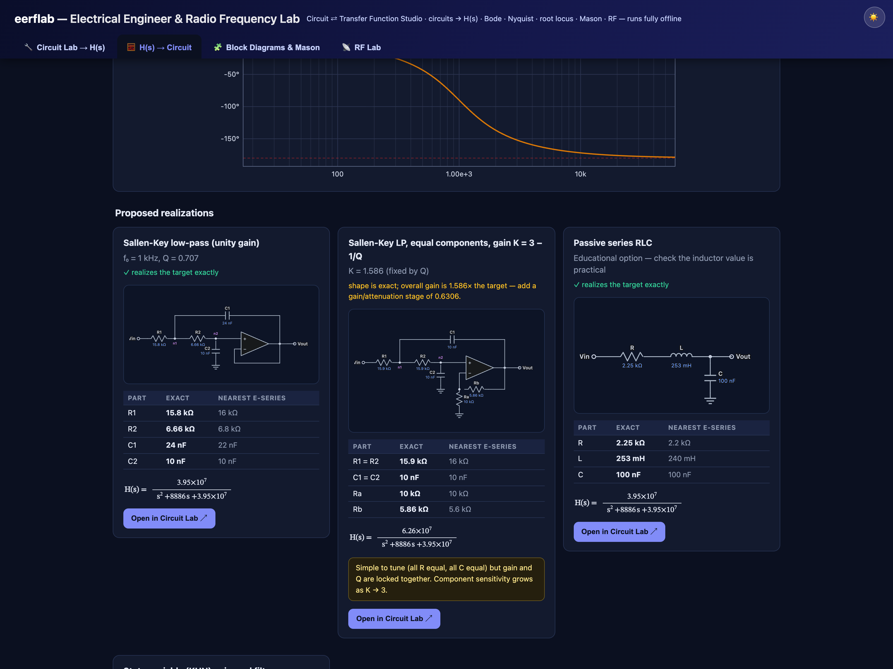
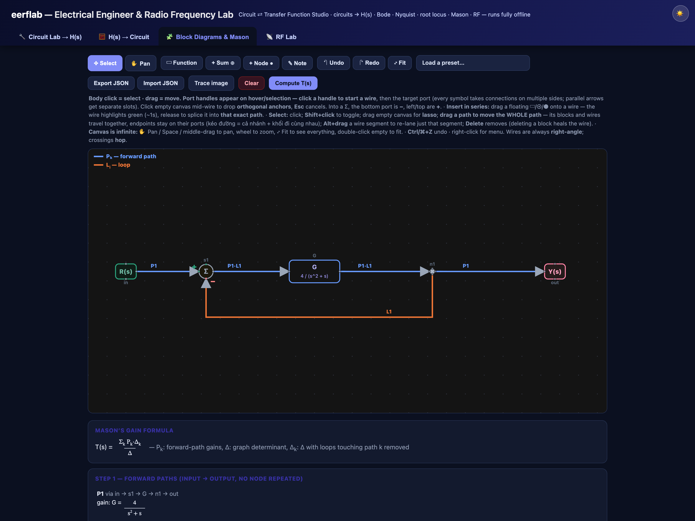
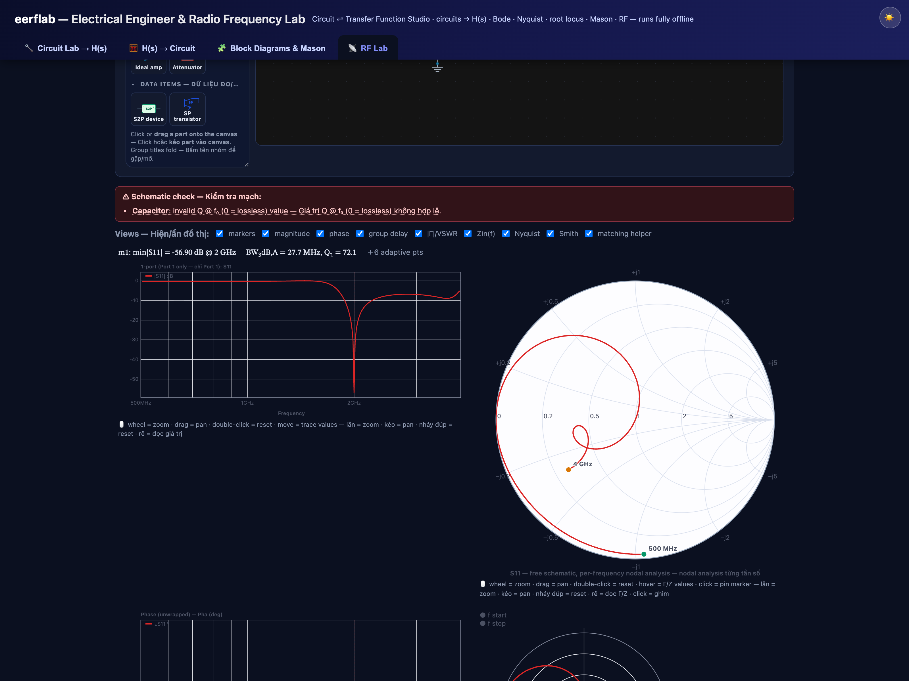

<!--
  Circuit ⇄ Transfer Function Studio — public project page
  Copyright © 2026 Hai Nguyen. All rights reserved.
  This page describes the application. The source code is NOT published here.
-->

<h1 align="center">Circuit ⇄ Transfer Function Studio</h1>

  <b>A free, offline, browser-based studio for circuits, control systems, and RF / microwave design.</b> 
  <i>Một studio miễn phí, chạy offline trên trình duyệt cho mạch điện, hệ điều khiển, và thiết kế RF / vi ba.</i>

  
  &nbsp;
  
  &nbsp;
  

  <b>▶ Try it now — Dùng thử ngay:</b> &nbsp; <a href="https://eerflab.com"><b>eerflab.com</b></a> 
  No sign-up, no install, nothing to download — it runs entirely in your browser. · Không cần đăng ký, không cài đặt — chạy hoàn toàn trong trình duyệt. 
  Mirror: <a href="https://eestudio.pages.dev">eestudio.pages.dev</a> · Current release: <b>v2.34.0</b> — 2026-07-16

---

## What is this? · Đây là gì?

**EN —** Circuit ⇄ Transfer Function Studio is an interactive teaching-and-design tool that connects three worlds that are usually taught separately: **analog circuits**, **control systems**, and **RF / microwave engineering**. Build a circuit and read its exact transfer function *H(s)*; go the other way and turn an *H(s)* into a real op-amp circuit; draw a block diagram and let Mason's rule solve it; or open the **RF Lab** to design matching networks, amplifiers, resonators, and microstrip lines with a live S-parameter solver, Smith chart, and optimizer. Every result is computed in your browser — nothing is uploaded, and it keeps working with no internet connection.

**VN —** Đây là công cụ tương tác vừa để **học** vừa để **thiết kế**, nối liền ba mảng thường được dạy riêng lẻ: **mạch analog**, **hệ điều khiển**, và **kỹ thuật RF / vi ba**. Vẽ mạch để đọc ra hàm truyền *H(s)* chính xác; hoặc đi ngược lại, biến một *H(s)* thành mạch op-amp thật; vẽ sơ đồ khối và để công thức Mason giải; hoặc mở **RF Lab** để thiết kế mạng phối hợp, mạch khuếch đại, cộng hưởng và đường vi dải với bộ giải S-parameter thời gian thực, Smith chart và tối ưu hoá. Mọi tính toán chạy ngay trong trình duyệt — không gửi dữ liệu đi đâu, và vẫn hoạt động khi không có internet.

---

## Screenshots · Ảnh minh hoạ

**Live Circuit Lab — DC bias (⎓ .op) then small-signal (∿ .ac) → exact H(s), the SPICE way · Circuit Lab trực tiếp — phân cực DC rồi tín hiệu nhỏ → H(s) chính xác**

**Nonlinear diode engine — a Zener regulator clamping live, with real breakdown voltage, current & power shown on the part · Bộ ổn áp Zener kẹp áp trực tiếp, hiện V/I/P thật trên linh kiện**

**Exact-MPN IC library — datasheet-verified 74HC / 74HCT / CD4000 parts with a 4-state logic kernel · Thư viện IC chính xác theo mã linh kiện — kiểm chứng từ datasheet, logic 4 trạng thái**

**H(s) → Circuit synthesis — a transfer function realized as a real op-amp circuit with E24 values · Tổng hợp H(s) → mạch op-amp thật với giá trị E24**

**Block Diagrams & Mason — Y/R solved by Mason's gain formula, every forward path and loop listed · Sơ đồ khối & Mason — giải Y/R bằng công thức Mason**

**RF Lab — single-stub matching with the live Smith chart and S-parameters · RF Lab — phối hợp single-stub với Smith chart & S-parameter thời gian thực**

**Modulation & EVM — a QAM constellation through AWGN, phase noise and PA compression · Điều chế & EVM — chòm sao QAM qua nhiễu, pha và nén PA**

---

## Features · Tính năng

### 🔧 Circuit Lab → H(s)
Build any linear circuit — resistors, capacitors, inductors, op-amps, dependent sources, BJT/MOS small-signal — from a **topology library**, a **drag-and-drop schematic editor**, custom Z₁/Z₂ impedances, or a **freeform netlist**. The app solves the node equations symbolically in *s* and gives you the **exact transfer function H(s)**, plus **Bode**, **Nyquist**, **pole/zero** maps, and the **step response**. Hover any point for exact values.

### ⚡ Live Circuit Lab — meters, scope & a real transient engine
The schematic is a **live bench**: voltmeters, ammeters and wattmeters read continuously, animated **current-flow dots** trace every series loop, and a four-channel **oscilloscope** shows the real waveforms. `⎓ .op` solves the **large-signal DC operating point** (real 0.7 V junctions, assume-and-verify) and `∿ .ac` runs the small-signal pass around it — **SPICE-style: pure-DC sources are treated as bias (AC ground) automatically**, so an amplifier sheet with a DC rail plus one AC input solves directly. Press **▶ Simulate** for the time-domain engine: switches, relays, the 555, logic gates and real **74xx / 40xx ICs** — including the **exact-MPN datasheet-verified library below** — 7-segment displays and an 8×8 **LED matrix**.

### 🩺 Honest semiconductor models — the nonlinear diode engine
Diodes run a real nonlinear model: forward knee or **SPICE-like exponential**, junction capacitance Cj(V), reverse recovery trr, and **reverse breakdown** with avalanche / Zener / TVS clamping — plus honest **OVERCURRENT / OVERPOWER / Tj** warnings and "no series resistor" traps that show the REAL numbers instead of hiding them. Ships with **datasheet-verified presets** (every value cites its source PDF): 1N4148, 1N4001–4007, 1N5817–19, **BAT54**, **SS14 / SS34**, the **SMAJ TVS family** (incl. bidirectional CA) and **BZX55 Zeners** with two-segment soft-knee breakdown.

### 🔬 Exact-MPN IC library — datasheet-verified digital parts
Beyond generic gates, the Circuit Lab ships a library of **63 real, orderable parts** (74HC / 74HCT / CD4000 plus the **NE555 timer** — Texas Instruments and Nexperia), each simulated **from its own manufacturer datasheet**: verified pin maps (pin numbers *and* names), per-family input thresholds (**74HC ratio** vs **74HCT TTL-fixed** vs **CD4000**, plus true **Schmitt-trigger hysteresis** with datasheet VT+/VT−), propagation delays, and **setup-time checking** on clocked devices. The engine is a **4-state logic kernel (0 / 1 / X / Z)** built to be *honest*: an unknown is reported as **X — never guessed** — and floating CMOS inputs, bus contention, and unpowered chips raise plain-language diagnostics instead of silently reading wrong. Every record carries **golden tests derived from the datasheet's own function tables and waveforms**, plus regression **guards for infamous look-alike pairs** (HC125 vs HC126 enable polarity, HC240/241/244, HC157 vs HC257, HC192 decade vs HC193 binary, CD4020 vs CD4040 pin layouts…). The verification process is thorough enough that it **caught a real erratum in a TI datasheet** (CD74HC147: the §5 pin table prints an "I0 input" on pin 9 — the TOP-VIEW figure and the device's own logic prove it is the Y0 output; the record documents it). Counters, shift registers, latches, decoders, priority encoders, multiplexers, magnitude/identity comparators, bus drivers and transceivers, ripple dividers, and up/down counters are all in the picker — plus the first **mixed-signal** part: an **NE555 timer** whose comparators watch the *real* CONT-pin voltage (the internal 5 kΩ string is stamped into the analog solver, so external control-voltage tricks genuinely move both trip points). *Next up: TL431 and exact op-amps (LM358 / TL081 / LM741).*

*Thư viện IC chính xác theo mã linh kiện: 63 chip thật, mô phỏng từ chính datasheet của từng con — sơ đồ chân kiểm chứng, ngưỡng vào theo đúng họ, trễ lan truyền, kiểm tra setup-time; kernel logic 4 trạng thái trung thực (không bao giờ đoán), kèm golden tests trích từ bảng chức năng của datasheet.*

### 🧮 H(s) → Circuit (synthesis)
Type a transfer function and get **real circuits that realize it** — Sallen-Key / MFB biquads, lead-lag, PID, and integrator-chain (analog-computer) forms — with **E24 component values** and an honest quality report (*exact / scaled / inverted*).

### 🧩 Block Diagrams & Mason
Draw a block diagram or signal-flow graph (or **trace over an uploaded figure**) and the app computes *Y/R* with **Mason's gain formula**, listing every forward path, loop, and Δ term step by step.

### 📡 RF Lab — ten workspaces
- **★ Schematic Designer** — a free-form RF bench: lumped R/L/C, transmission lines, open/short stubs, microstrip, `.s2p` devices, ideal amplifiers, attenuators, transformers, and complex loads. A per-frequency **nodal S-parameter solver** returns **S11/S21/S12/S22**, phase, group delay, **VSWR**, **Zin(f)**, Nyquist and **Smith-chart** views — all on **interactive plots** (wheel-zoom, drag-pan, click datatips).
- **Tune · Sweep · Optimize** — tick any parameter to get a live slider; **parameter sweeps** overlay curve families; **Monte-Carlo** reports yield against your goals; the **GOAL / OPTIM** optimizer (random or gradient) matches or beats your S-parameter targets.
- **Network & S-parameters** — cascade ABCD blocks and convert to S-parameters.
- **Device (.s2p) & amplifier** — load a Touchstone file, compute **K, |Δ|, μ, MSG/MAG**, draw **stability & gain circles**, and design a **simultaneous-conjugate-match** amplifier.
- **Matching calculator** — **L-section** and **single-stub** (open & short) networks with the **Smith-chart path** drawn out.
- **LineCalc + 2D EM** — microstrip synthesis/analysis (Hammerstad–Jensen) plus a real **finite-difference 2D field solver**.
- **Antennas & link budget** — dipole/patch sizing and the **Friis** equation.
- **Harmonic balance (PA)** — gain compression **P1dB**, harmonics, two-tone **IM3 / OIP3**.
- **System budget & mixer** — cascade **gain / noise figure (Friis) / OIP3** and a mixer **spur table**.
- **Eye diagram (SI)** and **Modulation & EVM** — send a PRBS through a lossy channel, or push QPSK…QAM-64 through AWGN, phase noise, and PA compression, and read the constellation + **EVM**.

### 📚 Built-in bilingual lectures
Every tool has a step-by-step **EN–VN lecture**: the theory in 60 seconds, a worked example with symbols and units, a walkthrough on the tool itself, and a check-yourself quiz.

### 💾 Truly offline
The whole studio is a **single HTML file**. No install, no accounts, no tracking — and it keeps running with the internet unplugged. Save the page and it is yours to use anywhere.

---

## Quick start · Bắt đầu nhanh

**EN**
1. Open **[eerflab.com](https://eerflab.com)**.
2. Pick a tab at the top: *Circuit Lab*, *H(s) → Circuit*, *Blocks*, or *RF Lab*.
3. In **RF Lab**, choose a part from the palette, click the canvas to place it, then wire **pin → pin**. Set your frequency sweep and substrate, and press **Simulate**.
4. Read the plots; **hover** for exact numbers; tick a value **tunable** to get a slider, or press **⚡ Optimize**.
5. Open the **📚 lecture** under any tool if you want the theory and a guided walkthrough.

**VN**
1. Mở **[eerflab.com](https://eerflab.com)**.
2. Chọn tab ở trên cùng: *Circuit Lab*, *H(s) → Circuit*, *Blocks*, hoặc *RF Lab*.
3. Trong **RF Lab**, chọn linh kiện ở thư viện, click lên canvas để đặt, rồi nối **chân → chân**. Đặt dải quét tần số và substrate, bấm **Simulate**.
4. Đọc đồ thị; **rê chuột** để xem số chính xác; tick **tunable** để có thanh trượt, hoặc bấm **⚡ Optimize**.
5. Mở **📚 bài giảng** dưới mỗi công cụ nếu muốn xem lý thuyết và hướng dẫn từng bước.

---

## Who is it for? · Dành cho ai?

Students learning circuit analysis, control systems, or RF/microwave engineering; instructors who want a live classroom demo; and engineers who need a quick, dependable sandbox for matching networks, amplifier stability, and S-parameter intuition — without launching heavyweight EDA software.

*Sinh viên học phân tích mạch, hệ điều khiển hay RF/vi ba; giảng viên cần demo trực quan trên lớp; và kỹ sư cần một môi trường nhanh, đáng tin cậy cho mạng phối hợp, ổn định mạch khuếch đại và trực giác S-parameter — mà không phải mở phần mềm EDA nặng nề.*

---

## ♥ Support · Ủng hộ

**EN —** This studio is free and ad-free, and it runs real solvers on a live server so anyone can use it right in the browser. If it helps you, a small donation helps **keep the servers online** and the whole studio **running and free for everyone**. Thank you for chipping in 🙏

**VN —** App miễn phí, không quảng cáo, chạy solver thật trên server để ai cũng dùng được ngay trên trình duyệt. Nếu thấy hữu ích, một khoản ủng hộ nhỏ giúp **duy trì server** và giữ mọi thứ **luôn chạy, miễn phí cho mọi người**. Cảm ơn bạn 🙏

  
  &nbsp;
  

🔒 Ko-fi accepts PayPal, cards, Apple Pay &amp; Google Pay, with checkout hosted securely by the provider (PCI-compliant) — no card details are ever handled by this project. — Ko-fi nhận PayPal, thẻ, Apple/Google Pay; thanh toán bảo mật do nhà cung cấp xử lý, dự án không bao giờ chạm vào thông tin thẻ.

---

## Usage & license · Sử dụng & bản quyền

**EN —** This project is **free to use, but not open source.** You are welcome to use the hosted web application at no cost for personal, educational, and professional work. The source code is **proprietary and is not published**: copying, redistributing, modifying, reverse-engineering, or creating derivative works is **not permitted** without prior written consent. See [`LICENSE`](LICENSE).

**VN —** Dự án này **miễn phí sử dụng, nhưng không phải mã nguồn mở.** Bạn được dùng miễn phí ứng dụng web cho mục đích cá nhân, học tập và công việc. Mã nguồn là **tài sản riêng và không được công bố**: nghiêm cấm sao chép, phân phối lại, chỉnh sửa, dịch ngược hay tạo sản phẩm phái sinh khi **chưa có** sự đồng ý bằng văn bản. Xem [`LICENSE`](LICENSE).

---

## Contact · Liên hệ

**Hai Nguyen** — Electrical Engineering
🔗 [linkedin.com/in/hai-nguyen-ee](https://www.linkedin.com/in/hai-nguyen-ee)

© 2026 Hai Nguyen. All rights reserved. — Bản quyền © 2026 Hải Nguyễn. Bảo lưu mọi quyền.

