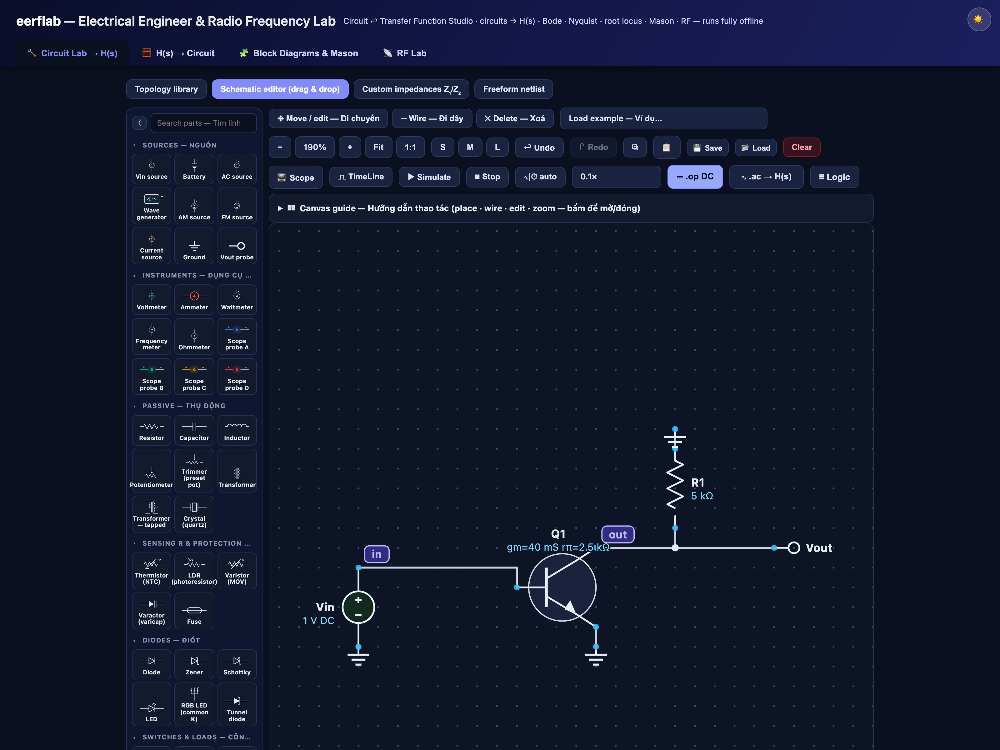
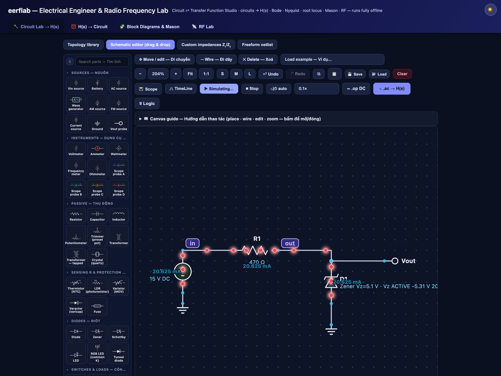
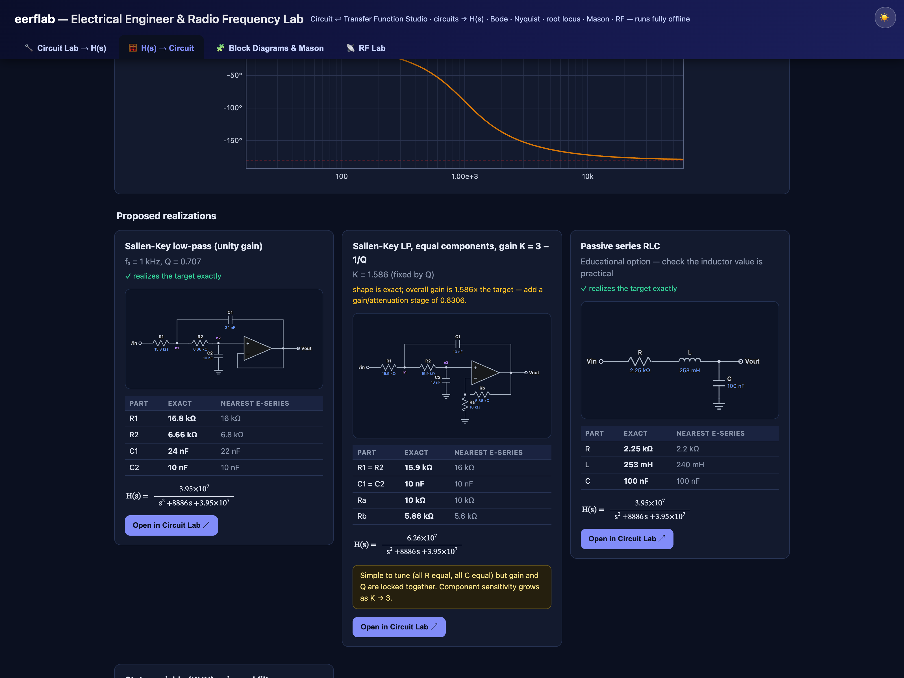
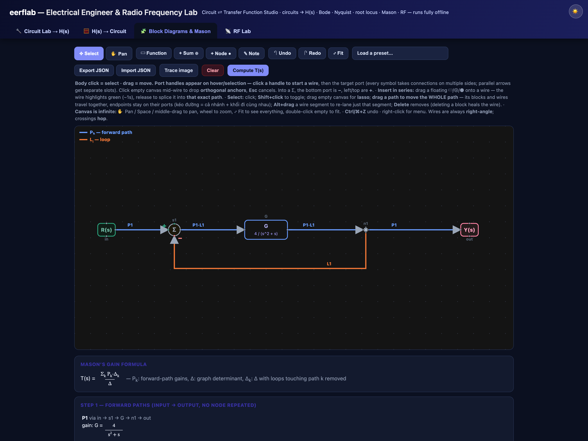
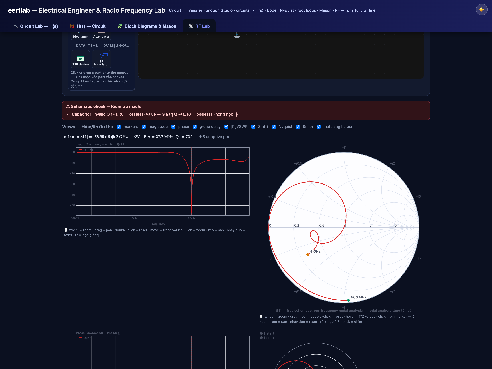
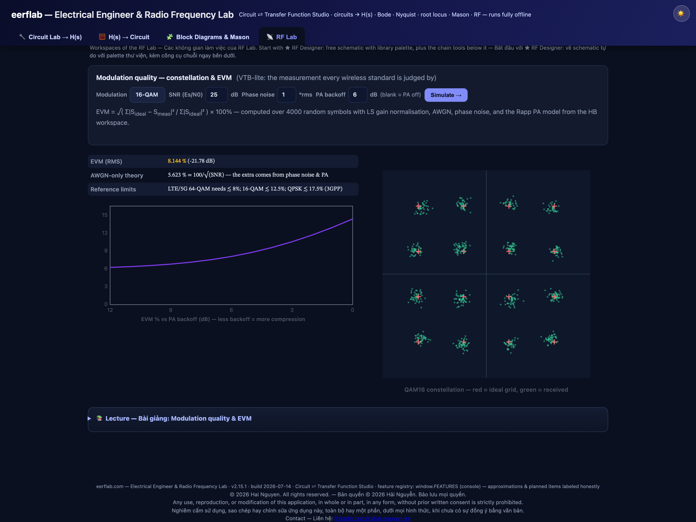
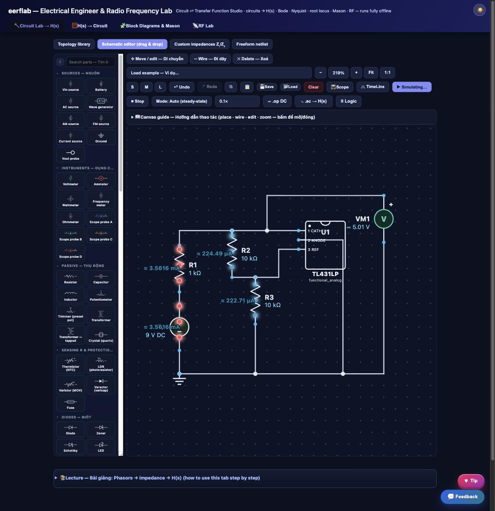
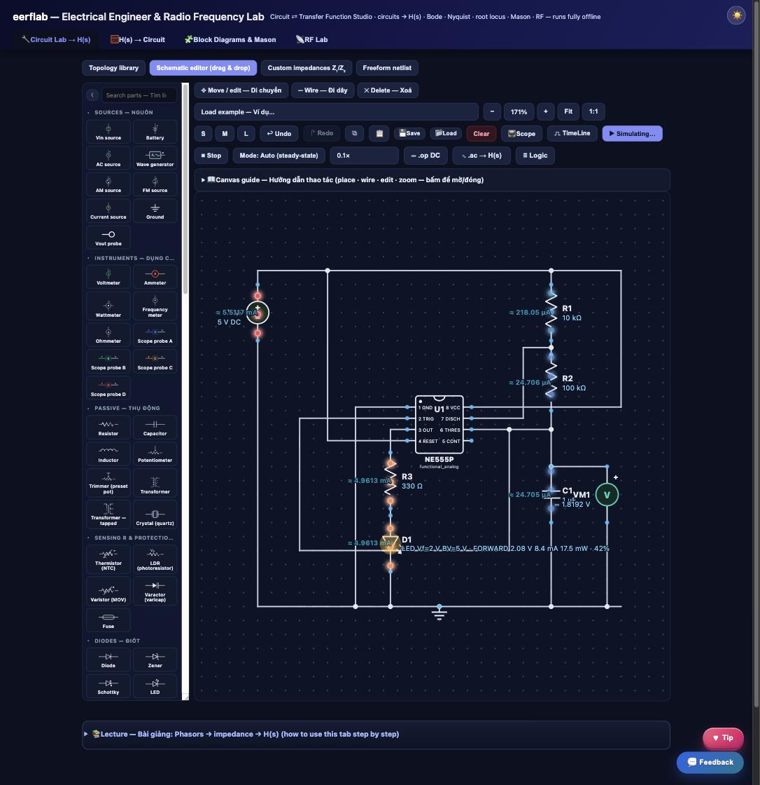

# ⚡ eerfLab — Circuit ⇄ Transfer Function Studio

### The free, offline-first Electrical Engineering & RF lab in a single file — from schematic to H(s), Bode, root locus, state-space, SPICE-grade transient physics, and back to a suggested circuit topology.

**🌐 Live app: [eerflab.com](https://eerflab.com)** · runs 100 % in your browser · no install · no account · works offline

**🇻🇳 Phòng thí nghiệm Điện – Điện tử – RF miễn phí, chạy hoàn toàn offline trong trình duyệt: từ sơ đồ mạch → hàm truyền H(s) → Bode / quỹ đạo nghiệm / không gian trạng thái → mô phỏng vật lý thật → và gợi ý ngược lại topology mạch.**

---

## 🧭 A complete solution — Schematic → Simulation → Analysis → Suggested Topology

Most tools give you one link of the chain. **eerfLab gives you the whole loop, in both directions:**

| Step | What you get | Công cụ |
|---|---|---|
| **1 · Schematic** | Drag-and-drop schematic editor: sources, passives, diodes/zeners/LEDs, BJT/MOSFET/JFET, transformers, machines, pots/trimmers, relays, fuses, speakers — plus a library of **93 exact, datasheet-verified ICs** picked by real MPN | Vẽ mạch kéo-thả, linh kiện thật theo mã |
| **2 · Simulation** | One click ▶ — DC operating point, AC → H(s), and a **real time-domain transient engine**: exponential Ebers-Moll BJTs (SPICE `pnjlim` convergence), switch-level power MOSFETs, coupled-inductor transformers, dq-model electric machines, I²t & power-rating "boom" physics, honest refusals when an op point is non-physical | Mô phỏng ⏱ vật lý thật, linh kiện quá tải nổ như đời thực |
| **3 · Analysis** | Exact **H(s)** (MNA nodal analysis + minimal rational fit), factored poles/zeros, Bode with GM/PM markers, step, Nyquist + encirclement criterion, **root locus**, closed-loop step, **state-space ẋ = Ax+Bu (controllable canonical)** with one-click **MATLAB / Python export**, Monte Carlo, noise, FFT/THD, PCB trace calculators (IPC-2221/2152) | Phân tích H(s), Bode, Nyquist, quỹ đạo nghiệm, không gian trạng thái, xuất MATLAB/Python |
| **4 · Suggested topology** | Type ANY H(s) and the studio **designs circuits for you**: cascade of first/second-order op-amp stages with concrete E-series R/C values, **KHN state-variable biquads**, lag/lead compensators, and the full **analog-computer integrator chain** — each stage openable back in the Circuit Lab. RHP poles are flagged honestly ("needs a stabilizing loop"), never hidden | Nhập H(s) bất kỳ → app tự đề xuất mạch: cascade op-amp, KHN biquad, chuỗi tích phân analog computer — mở ngược lại vào Circuit Lab |

That loop — **circuit → math → circuit** — is what makes eerfLab a *studio*, not just a simulator.

---

## 🆕 What's new (v2.76 line)

- **⚡ SG3525 + IRFZ44N H-bridge inverter — 12 V → 230 V / 50 Hz** (REAL CHIP). We took a widely-shared web schematic, **debugged it against the ST/onsemi datasheets**, fixed its real errors (error-amp reference, shutdown-chain sizing, overvoltage-trim math), and shipped it as a live example: true bootstrap gate drive, PWM latch (one pulse per period), 50 µA soft-start you can watch, low-battery LM393 shutdown with red-LED alarm. The oscilloscope shows the 230 V quasi-square being born.
- **🔌 Transformer goes time-domain** — coupled-inductor model (Lp, Ls, M, coupling k) live in transient, powering the inverter's 12:233 step-up.
- **📡 SG3525AN & LM393P join the exact-IC library** — oscillator law `f = 1/(CT·(0.7·RT + 3·RD))` sensed from *your* drawn RT/CT/RD parts, push-pull steering at f/2, error amp as a real Norton stage so your compensation network actually closes the loop.
- **⚙ Electric machines trilogy** — 3φ induction **motor** (full stationary-frame dq dynamic model, EE 350 Lab 8 reproduced row-for-row), 3φ induction **generator** (drive past synchronous, watch power flow reverse into the grid), and the separately-excited **DC motor** (Lab 7: field time-constant, armature inrush, weak-field overshoot — all real).
- **🔊 Class-AB power amplifier, FULL 22-transistor build** (2SC5200/2SA1943 triple-EF output, LED-referenced current sources, cascoded VAS) — decoded 1:1 from the original schematic print, with the DC operating point solved by a new **pseudo-transient soft-power-up** DCOP engine.
- **🧨 Physics that tells the truth** — exponential BJTs (E45), a DCOP rescue ladder (source ramp → gmin → pseudo-transient continuation, E46), and hard refusal of non-physical operating points instead of silently destroying parts (E44).

---

## 📊 By the numbers

- **93 exact ICs** — datasheet-verified, pin-for-pin, picked by MPN (NE555P, TL431, LM358/LM324/LM741, LM393/LM339, TL08x/TL43x, CD4000 & 74HC logic families, CD74HC4046A PLL, MAX4374, MC34063, TL494, UC3842, **SG3525AN**, …) with per-part golden tests and refusal diagnostics (floating pins, missing supply, out-of-range VCC)
- **273-row research pipeline** of further parts, none placeable until verified — accuracy over quantity
- **60 + generic component models** — R/L/C/pots, diode family with breakdown & thermal ratings, BJT/MOSFET/JFET, transformers (incl. tapped), machines, relays, fuses, thermistor/LDR/varistor/varactor, speakers, crystals…
- **10 auto-running live examples** — battery protector (MAX4374), 180 V boost (MC34063 + IRF644), **SG3525 inverter**, 3φ motor, 3φ generator, DC motor, 555 blinker, TL431 regulator, LM358 swing lesson, HC4046 PLL lock — each with a bilingual engineering walk-through in the hint
- **2,000 + automated regression checks** run before every release — solver math, IC golden tests, preset physics, UI lint
- **4 integrated labs** — Circuit Lab → H(s) · H(s) → Circuit · Block Diagrams & Mason's gain formula · RF Lab (Smith chart, S-parameters, matching, stability circles)
- **1 file, 0 servers** — the whole studio ships as a single offline HTML file

---

## 🎓 Who it's for

- **Students** — see *why* the textbook Bode plot looks that way; drag a slider and watch poles move
- **Educators** — every live example is a prepared lecture: real chips, real failure modes, honest limitations
- **Practicing engineers** — quick H(s) sanity checks, compensator sketches, state-space export to MATLAB/Python, PCB trace-width math
- **Hobbyists & makers** — build the inverter or the 555 blinker exactly like the web schematic — except this one has been debugged for you

*No account. No cloud. Your designs stay on your machine.*

---

## 🖼 Screenshots

| | |
|---|---|
|  |  |
|  |  |
|  |  |
|  |  |

---

## 🔑 Keywords / Từ khóa

free online circuit simulator · transfer function calculator · H(s) from circuit · Bode plot online · Nyquist plot · root locus tool · state-space realization · controllable canonical form · MNA nodal analysis · SPICE alternative in browser · op-amp filter synthesis · KHN biquad designer · Sallen-Key · lag lead compensator · Mason's gain formula solver · signal flow graph · Smith chart matching · S-parameters · SG3525 inverter simulation · MC34063 boost converter · class AB amplifier design · 555 timer circuit · PLL CD4046 · three-phase induction motor simulation · DC motor transient · power electronics lab · electrical engineering education — mô phỏng mạch điện online miễn phí · hàm truyền · đồ thị Bode · quỹ đạo nghiệm · tổng hợp mạch op-amp · mạch nghịch lưu SG3525 · động cơ không đồng bộ 3 pha · phòng thí nghiệm điện tử ảo

---

## 🚀 Try it now

**→ [eerflab.com](https://eerflab.com)** — press **Load example**, pick the ⚡ SG3525 inverter, and watch a 12 V battery become 230 V AC in front of you.

*Built with an obsession for honest physics: if the model can't simulate something faithfully, it says so — in English and Vietnamese.*

— **Hai (Steve) Nguyen** · Electrical Engineering, CSULB · [LinkedIn](https://www.linkedin.com/in/hai-nguyen-ee)
